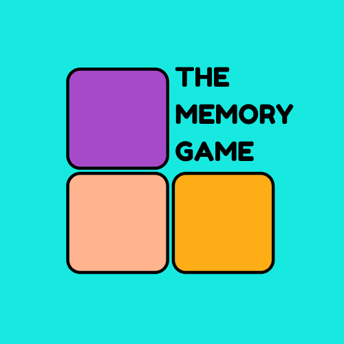

# MILESTONE PROJECT 2 - THE MEMORY GAME

[View live website](https://shiba517.github.io/MSP2-The-Memory-Game/)

## OVERVIEW
A study in 2004 by Vladimir Sloutsky found children performed better than adults at a surprise recognition test that was based on the idea that children are more likely to use an induction like thinking when analysing pictures whilst adults are more likely to use a category like thinking. Another recognition experiment was done on another group of children and adults but the test was not a surprise. The results were that adults performed much better than the children.

The mayor of London did not like how much better the adults performed in the latter test. He has hired me to create a game where children's memory skills will be tested, exercised and improved so that the next time this experiment is performed, his local children will close or even beat the performance gap.

## USER EXPERIENCE (UX)
### Project Goals
Player goals
* As a player, I want to be challenged on my memory Parental goals
* As a parent, I want the game to improve on my children memory muscles Developer and business goals
* As a developer and business person, I want children to want to play the game as often as they could with also encouragement from their parents.

### User Stories
Player/child
* First time visitor goals:
    * I want to be excited about the game via its visual
    * I want to easily find out/be explained of the rules and how to play the game
* Returning visitor goals:
    * I want to easily start the game without too many clicks
    * I want to easily find the rules in case it’s been a while and I need a recap of the rules and how to play
* Frequent visitor goals:
    * I want to know of my previous progress in the game

Parents
* First time visitor goals:
    * I want my child to be excited about the game
    * I want my child to easily understand the rules of the game and how to play the game

* Returning visitor goals:
    * I want my child to want to play the game as it has a good balance of challenge and fun

* Frequent visitor goals:
    * I want my child to not eventually get bored of the game

Developer and business person
* First time visitor goals:
    * I want to feel excited and playful
* Returning visitor goals:
    * I want the users to play again in as quickly as possible without too many boring clicks
* Frequent visitor goals:
    * I want parents to encourage their children to play again as the children memory is clearly getting better

## THE 5 PLANES
### Strategy
Purpose of the website?
* The purpose of the website is to challenge young children's memory skills, and to exercise it to become better via a fun game.

Target audience?
* The main audience will be children of primary school age as the game/website is to improve children's memory skill. It should be considered throughout the making of the project that parents should also be listed as a secondary audience target as they have the power for the children to have access to the website/game.

Value to the user?
* The user should enjoy the game so it shouldn’t be too difficult or too easy to the point where they will find it boring. As according to the purpose of the making of the game, the user should have their memory skills improve which the user most likely won’t notice but the secondary target audience, the parents, surely will.

What makes a good experience?
* A vibrant, playful colour scheme will evoke excitement to the user. Physical designs of the game should be easily noticeable and not abstract to help keep the simplicity of the look of the game.

How are we different?
* We will really push the subtly push the child's memory skill through dynamic difficulty levels and challenges to keep the children engaged. This game won’t be one dimensional to the point where a child will quickly get bored as children are prone to.

What we shouldn’t do
* Make the game too difficult or easy
The colours to be too dull or adult oriented. It should be remembered that parents are the secondary user, not the main user
Add too many options/features as this may confuse or/and put off the child from wanting to play

### Scope
Feature
* Difficulty level for all intelligence level
* Be able to save the high score for repeat visits
* Explanation of the rules/how to play
* Find out about the company

Content
* Do not contain long sentences as this can bore children. Keep it short and with action
* Imagery should be fun/cute
* No gender bias use of language or visuals as it is a game to solely test memory

Future alterations/additions
* The ability to change visuals to narrow down target audiences. For example, the options to change visuals that will engage with girls more than boys and visa versa.

### Structure
Interactive design
* Colour theme and visuals (i.e., design and positioning of buttons) must be consistent throughout
* Should be obvious when a something has been clicked especially during the game

Information Architecture
* Linnear narrative because he target audience are children therefore navigation must be simple without unnecessary ‘branches’
Nested List becasue it provides straight forward links to chosen destinations. Should also get to the final game within three clicks

### Skeleton
Mobile Version
* Black and white
    * Landing/Home screen - [image](assets/readme-files/images/wireframes/wf-mobile-bw-homePage.png)
    * How to play screen - [image](assets/readme-files/images/wireframes/wf-mobile-bw-howToPlay.png)
    * Lets play screen - [image](assets/readme-files/images/wireframes/wf-mobile-bw-letsPlay.png)
    * About us screen - [image](assets/readme-files/images/wireframes/wf-mobile-bw-aboutUs.png)
    * The game screen - [image](assets/readme-files/images/wireframes/wf-mobile-bw-theGame.png)
    * Game over screen - [image](assets/readme-files/images/wireframes/wf-mobile-bw-gameOver.png)
* Colour - Was made after the 'Surface' section was written
    * Landing/Home screen - [image](assets/readme-files/images/wireframes/wf-mobile-clr-homePage.png)
    * How to play screen - [image](assets/readme-files/images/wireframes/wf-mobile-clr-howtoPlay.png)
    * Lets play screen - [image](assets/readme-files/images/wireframes/wf-mobile-clr-letsPlay.png)
    * About us screen - [image](assets/readme-files/images/wireframes/wf-mobile-clr-aboutUs.png)
    * The game screen - [image](assets/readme-files/images/wireframes/wf-mobile-clr-theGame.png)
    * Game over screen - [image](assets/readme-files/images/wireframes/wf-mobile-clr-gameOver.png)

Laptop/PC Version
* Black and white
    * Landing/Home screen - [image](assets/readme-files/images/wireframes/wf-laptopPC-bw-homePage.png)
    * How to play screen - [image](assets/readme-files/images/wireframes/wf-laptopPC-bw-howToPlay.png)
    * Lets play screen - [image](assets/readme-files/images/wireframes/wf-laptopPC-bw-letsPlay.png)
    * About us screen - [image](assets/readme-files/images/wireframes/wf-laptopPC-bw-aboutUs.png)
    * The game screen - [image](assets/readme-files/images/wireframes/wf-laptopPC-bw-theGame.png)
    * Game over screen - [image](assets/readme-files/images/wireframes/wf-laptopPC-bw-gameOver.png)
    
* Colour - Was made after the 'Surface' section was written
    * Landing/Home screen - [image](assets/readme-files/images/wireframes/wf-laptopPC-clr-homePage.png)
    * How to play screen - [image](assets/readme-files/images/wireframes/wf-laptopPC-clr-howToPlay.png)
    * Lets play screen - [image](assets/readme-files/images/wireframes/wf-laptopPC-clr-letsPlay.png)
    * About us screen - [image](assets/readme-files/images/wireframes/wf-laptopPC-clr-aboutUs.png)
    * The game screen - [image](assets/readme-files/images/wireframes/wf-laptopPC-clr-theGame.png)
    * Game over screen - [image](assets/readme-files/images/wireframes/wf-laptopPC-clr-gameOver.png)

### Surface
Colour Theme
* A shade of light blue - #17E9E0/rgb(23,233,224) - [example](assets/images/surface-colour-theme/colour-example-17E9E0.jpg)
* A shade of yellow - #FCCD04/rgb(252,205,4) - [example](assets/images/surface-colour-theme/colour-example-FCCD04.jpg)
* A shade of purple - #A64AC9/rgb(166,74,201) - [example](assets/images/surface-colour-theme/colour-example-A64AC9.jpg)
* A peach like colour - #FFB48F/rgb(255,180,143) - [example](assets/images/surface-colour-theme/colour-example-FFB48F.jpg)
* A very light shade of cream - #F5E6CC/rgb(245,230,204) - [example](assets/images/surface-colour-theme/colour-example-F5E6CC.jpg)

Typography
* Main headings - [link](https://fonts.google.com/specimen/Comfortaa?query=comfort)
* Regular text - [link](https://fonts.google.com/specimen/Montserrat?query=mont)

## FEATURES
### Existing Features
* Header section – Contains the title of the game. Will be on display on every screen 
* Home screen – contains the game menu and the website logo 
* Game menu – Has three buttons (How to play, Start, and About us) which links to different screens 
    * How to play – takes user to a screen where the rules of the game are explained 
    * Start – takes user to a screen where the user will have the option to choose the difficulty level of the game 
    * About us – takes user to a screen explaining about the company that had made the game 
* Game options – Icons that are mostly available whilst playing the game 
    * Home icon – leads user to the opening screen 
    * Pause icon – lets user pause the game 
    * Help icon – icons on the field cards will be on display for a short period of time 
    * Sound icon – lets user have background music or not. This is the only icon that is always available on every screen 
* Game info – split into three parts; lives, time and points 
    * Lives – will show how many lives user. Once it hits 0, the game will end 
    * Timer – a countdown of each round. Will differ depending on which game mode is selected 
    * Points – accumulation of points depending on users actions 
* The Game – this is when and where the game will be played. Will include head cards and field cards 
    * Head cards – these are cards the user will have to find a match for within the field cards 
    * Field cards – these cards will have its icons on display for a short period of time before it disappears. User must select the card that had an icon that is the same as the one displayed on the head cards. 
    * Game icons and game options will be on display too but not the game options 
* Game over – informs the user the game has ended and will contain information regarding the final points.  
* Footer – contains icons linking to websites social media pages.  

### Future Features
* A logo of higher pixel qulity. Due to funds being low, it was not financially feasible to have downloaded a higher pixel quality version of the logo
* Ability to change how high or low the background music. At the moment, it is either off or on
* Some animation of the icons such as flash, or animals bouncing off the screen 

## TECHNOLOGIES USED
* HTML
* CSS
* Bootstrap - a mobile first library which was heavily used - [link](https://getbootstrap.com/)
* Font awesome - all icons were found and used from here - [link](https://fontawesome.com/)
* Jquery - a lightweight JavaScript library - [link](https://jquery.com/)
* GitHub - where I deployed my project - [link](https://github.com/)
* Gitpod - where I typed and recorded my codes. Can be found via the GitHub website
* Balsamiq - frameworks were made using their app/software - [link](https://balsamiq.com/)
* Free Logo Design - created the website logo from here - [link](https://www.freelogodesign.org/)
* Giphy - Created the gif files from this website - [link](https://giphy.com/)
* Photos - an app which I used to resize selected images; mainly the images found in README.md. It is available on Windows 10.
* Paint 3D - an app I used to help resize and mark images; mainly the images found in README.md. It is available on Windows 10.
* W3C Markup Validator - used this website to detect any errors in my index.html - [link](https://validator.w3.org/#validate_by_upload)
* W3C CSS Validator - used this website to detect any errors in my style.css - [link](https://jigsaw.w3.org/css-validator/)

## TESTING
### User Experience Testing
Player/child
* First time visitor goals:
    * I want to be excited about the game via its visual
        * A fun logo appears on the opening screen - [example](assets/images/logo.png)
        * Dominant background colour of blue brightens up the screen - [example](assets/images/ux-testing/blue-background-brightening-the-sccreen.gif)
        * Fun/cute looking icons are used for the cards - [example](assets/images/ux-testing/cute-icons.jpg)
        * High numbered points system (100 points or 2000 points) is more exciting than low numbered points system (1point or 10 points) - [example](assets/images/ux-testing/high-points-system.jpg)
    * I want to easily find out/be explained of the rules and how to play the game
        * A button leading to the description/explanation of the game can be found on the first screen - [example](assets/images/ux-testing/how-to-play-description.jpg)
* Returning visitor goals:
    * I want to easily start the game without too many clicks
        * No more than two clicks are needed to get the game started - [example](assets/images/ux-testing/no-more-than-two-clicks-for-start.gif)
    * I want to easily find the rules in case it’s been a while and I need a recap of the rules and how to play
        * A button leading to the description/explanation of the game can be found on the first screen 
* Frequent visitor goals:
    * I want to know of my previous progress in the game
        * This is not available yet due to limited skills but has been included in the features section of this document for future consideration under the subheading ‘Future features’ 

Parents 
* First time visitor goals:
    * I want my child to be excited about the game 
        * A fun logo appears on the opening screen 
        * Dominant background colour of blue brightens up the screen 
        * Fun/cute looking icons are used for the cards 
        * High numbered points system (100 points or 2000 points) is more exciting than low numbered points system (1point or 10 points) 
    * I want to easily find out/be explained of the rules and how to play the game
        * A button leading to the description/explanation of the game can be found on the first screen 
* Returning visitor goals:
    * I want my child to want to play the game as it has a good balance of challenge and fun 
        * The speed of the game increases which adds another dynamic to the level of challenge the game has. Also, there is a help option available to help create the balance of challenging and too challenging - [example](assets/images/ux-testing/game-does-get-faster-for-challenge.jpg)
* Frequent visitor goals:
    * I want my child to not eventually get bored of the game 
        * The user will be asked to choose how difficult they would like the game to be before the game starts. This will help prevent the child from getting bored of the game if the game becomes too easy - [example](assets/images/ux-testing/choice-of-difficulty.jpg)

Developer and business person  
* First time visitor goals:
    * I want the user to feel excited and playful 
        * Bright and complimentary colours, fun/cute icons and objects, high scoring system and sound make up an exciting first experience   
* Returning visitor goals:
    * I want the users to play again in as quickly as possible without too many boring clicks 
        * The use will be able to start within two necessary clicks  
* Frequent visitor goals:
    * I want parents to encourage their children to play again as the children memory is clearly getting better 
        * Choice of difficulty level can be used to see how much better the childs memory is getting better 
        * Countdown and the length of time the icons are shown adds to the dynamics of the challenge 
        * Points system can help the parents and the child, ‘measure’ their skill/progress of the game and their memotry 

### Cross Platform Testing 
#### Basics playing of the game
AIM | mobile | tablet | laptop/PC
--- | --- | --- | ---
Does matching all the field card with the relevant head card eventually lead to all cards being reset? | yes | yes | [yes](assets/images/cross-platform-testing/cards-resetting-when-all-cards-match.gif)
Does not matching a field card with the relevant head card lead Lives decreasing as intended? | yes | yes | [yes](assets/images/cross-platform-testing/lives-decreasing-when-no-match.gif) 
Points increase when all field cards matches | [yes](assets/images/cross-platform-testing/points-increase.gif) | yes | yes
Points decrease when a field card does not match | yes | yes | [yes](assets/images/cross-platform-testing/points-decrease-when-no-match.gif)
When timer reaches 0, does Lives decrease as intended? | yes | yes | [yes](assets/images/cross-platform-testing/lives-decreasing-when-timer-is-0.gif)
When timer reaches 0, do all cards reset? | yes | yes | [yes](assets/images/cross-platform-testing/cards-reseting-when-timer-is-0.gif)
Is the game over once Lives reaches 0? | yes | yes | [yes](assets/images/cross-platform-testing/game-over-when-lives-is-0.gif)
Does the length of the Preview time decrease as the game goes on as intended? | yes | yes | [yes](assets/images/cross-platform-testing/preview-time-updating.jpg)
Are bonus points added to the total as intended?  | yes | yes | [yes](assets/images/cross-platform-testing/bonus-points-are-being-added.jpg)
Do points increase as intended when all cards match? | yes | yes | yes
Do points decrease as intended when card does not match?| yes | yes | yes
do points decrease as intended when help icon is clicked?| yes | yes | yes

#### Basic navigation of screens/sections
AIM | mobile | tablet | laptop/PC
--- | --- | --- | ---
Clicking on ‘How to play’ button always leads to ‘How to Play’ section (Section 2.2) on show  | yes | yes | yes
Clicking on ‘Start’ button always leads to ‘Start Game’ section (Section 2.3) on show | yes | yes | yes
Clicking on ‘About us’ button always leads to ‘About Us’ section (Section 2.4) on show | yes | yes | yes
Clicking on ‘easy’ button from ‘About Us’ section (Section 2.4) leads to ‘The Game’ section (Section 2.5) on show | yes | yes | yes
Clicking on ‘medium’ button from ‘About Us’ section (Section 2.4) leads to ‘The Game’ section (Section 2.5) on show | yes | yes | yes
Clicking on ‘hard’ button from ‘About Us’ section (Section 2.4) leads to ‘The Game’ section (Section 2.5) on show | yes | yes | yes
Clicking on the Facebook icon leads to the Facebook site opening on a separate tab | yes | yes | yes
Clicking on the Instagram icon leads to the Instagram site opening on a separate tab | yes | yes | yes
Clicking on the Twitter icon leads to the Twitter site opening on a separate tab | yes | yes | yes
Clicking on the YouTube icon leads to the YouTube site opening on a separate tab | yes | yes | yes
Clicking on the Facebook icon leads to the Facebook site opening on a new screen | yes | yes | yes
Clicking on the Instagram icon leads to the Instagram site opening on a new screen | yes | yes | yes
Clicking on the Twitter icon leads to the Twitter site opening on a new screen | yes | yes | yes
Clicking on the YouTube icon leads to the YouTube site opening on a new screen | yes | yes | yes

#### Basic visuals of the game
AIM | mobile | tablet | laptop/PC
--- | --- | --- | ---
9 Field cards should be on show when ‘The Game’ section (Section 2.5) is on show | [yes](assets/images/cross-platform-testing/nine-field-cards-are-on-show-on-mobile-screen.jpg) | [yes](assets/images/cross-platform-testing/nine-field-cards-are-on-show-on-tablet-screen.jpg) | [yes](assets/images/cross-platform-testing/nine-field-cards-are-on-show-on-laptop-screen.jpg)
Footer section should not be visible when ‘The Game’ section (Section 2.5) is on show | [yes](assets/images/cross-platform-testing/no-footer-during-the-game.jpg) | yes | yes
When on easy mode, 1 head card is on show | yes | yes | [yes](assets/images/cross-platform-testing/one-head-card-on-show-during-easy-mode.jpg)
When on medium mode, 2 head cards are on show | yes | yes | [yes](assets/images/cross-platform-testing/two-head-card-on-show-during-medium-mode.jpg)
When on hard mode, 3 head cards are on show | yes | yes | [yes](assets/images/cross-platform-testing/three-head-card-on-show-during-hard-mode.jpg)
‘Game options’ section (Section 1.3) should be visible above the ‘Game Info’ section (Section 1.2) when ‘The Game’ section (Section 2.5) is on show | yes | [yes](assets/images/cross-platform-testing/game-options-above-game-info.jpg) | yes
When a card matches, the chosen field card turns green | [yes](assets/images/cross-platform-testing/field-card-turning-green.jpg) | yes | yes
When a card does not match, the chosen field card turns red | yes | [yes](assets/images/cross-platform-testing/field-card-turning-red.jpg) | yes
When all card matches, all field cards turn green | yes | yes | [yes](assets/images/cross-platform-testing/all-field-cards-turning-green.jpg)
When lives reaches to 0, all field cards turn red | yes | yes | [yes](assets/images/cross-platform-testing/all-field-cards-turning-red.jpg)
Lives icon and quantity is visible | yes | yes | [yes](assets/images/cross-platform-testing/lives-icon-quantity-on-display.jpg)
Timer icon is a clock before the cards are clickable | yes | [yes](assets/images/cross-platform-testing/timer-is-a-clock.jpg) | yes
Once field cards are clickable, clock icon is removed and replaced with numbers acting as a countdown | yes | [yes](assets/images/cross-platform-testing/clock-icon-becomes-a-countdown.jpg) | yes
When timer reaches 0, the countdown number is replaced by a poo icon | yes | yes | [yes](assets/images/cross-platform-testing/countdown-becomes-a-poo-icon.jpg)
When lives reaches 0, the countdown number is replaced by a skull icon | yes | [yes](assets/images/cross-platform-testing/skull-icon-appearing-when-game-is-over.jpg) | yes
When all cards match, the countdown number is replaced by a human icon | yes | yes | [yes](assets/images/cross-platform-testing/perons-icon-appearing-when-all-cards-matches.jpg)
When lives reaches 0, ‘Game Over’ section (Section 2.6) will be on show | yes | [yes](assets/images/cross-platform-testing/game-over-section-appears-when-lives-reaches-zero.jpg) | yes
When ‘Game Over’ screen does occur, the ‘Start’ button text is replaced by the text ‘Play again’ | yes | yes | [yes](assets/images/cross-platform-testing/start-text-turns-to-play-again.jpg) 

#### Game options icon testing
AIM | mobile | tablet | laptop/PC
--- | --- | --- | ---
When field cards are not clickable, Preview mode, only the Music icon is clickable | yes | yes | yes
All ‘Game Options’ icons are clickable once the field cards are out of preview mode | yes | yes | yes
A modal pops up when the Home icon is clicked | yes | yes | [yes](assets/images/cross-platform-testing/modal-pops-up-when-home-icon-is-clicked.jpg)
Clicking on the ‘YES’ button leads user to a screen looking exactly like the screen when the user first opened the game | yes | yes | [yes](assets/images/cross-platform-testing/clicking-on-yes-button.gif)
Clicking on the ‘NO’ button resumes the game | yes | yes | [yes](assets/images/cross-platform-testing/clicking-on-no-button.gif)
Pause and Help icon should not be clickable when Home icon has been clicked on | yes | yes | yes
Pause icon should lead to timer not changing and staying at current state | yes | [yes](assets/images/cross-platform-testing/pause-icon-pausing-time.gif) | yes
Only Help icon should not be clickable when Pause icon has been clicked | yes | yes | yes
Clicking on Pause icon again should resume the game | yes | yes | [yes](assets/images/cross-platform-testing/pause-icon-toggling.gif)
Clicking on Help icon should temporarily show the icons on the field cards | [yes](assets/images/cross-platform-testing/help-icon-working.gif) | yes | yes
Clicking on the Music icon should play a background music | yes | yes | yes
Clicking on it again should stop playing the background music | yes | yes | yes

#### Audio of the game 
AIM | mobile | tablet | laptop/PC
--- | --- | --- | ---
A positive sounding sound occurs when a field card matches | yes | yes | yes
A negative sounding sound occurs when a field card does not match | yes | yes | yes
A doomed sounding sound occurs when the game is over | yes | yes | yes
A fun sounding music occurs and turns off when the music icon is clicked in a toggle like manner | yes | yes | yes 

### Bugs and Fixes
Bugs | Fixes
--- | ---
Text sizing looking very akward on an Ipad - [example](assets/images/bugs-and-fixes/modal-text-akward-on-ipad.jpg) | Was resolved my extending the width of the modal via .nbs-modal-popup - [example](assets/images/bugs-and-fixes/modal-text-akward-on-ipad-resolved.jpg)

### Validation
* I used the [W3C Validator](https://validator.w3.org/#validate_by_upload) website to check for any errors in my [index.html](index.html) file. Below are the results:
    * Attempt 1: [Image 1](assets/images/validation/index-html-validation-attempt-1-p1.jpg), [Image 2](assets/images/validation/index-html-validation-attempt-1-p2.jpg), [Image 3](assets/images/validation/index-html-validation-attempt-1-p3.jpg), [Image 4](assets/images/validation/index-html-validation-attempt-1-p4.jpg)
    * Attempt 2: [Image 1](assets/images/validation/index-html-validation-attempt-2-p1.jpg)
* I used the [W3C Jigsaw Validator](https://jigsaw.w3.org/css-validator/) website to check for any errors in my [style.css](assets/css/style.css) file. Below are the results:
    * Attempt 1: [Image 1](assets/images/validation/stye-css-jigsaw-validation-attempt-1-p1.jpg)
    * Attempt 2: [Image 1](assets/images/validation/stye-css-jigsaw-validation-attempt-2-p1.jpg)

## DEPLOYMENT
### Github pages
The website was deployed onto GitHub via the following steps: 
1. Logging into my GitHub account and creating a new repository
2. Under the subheading ‘Repository template’, I chose the template given to me by Code Institute from the drop-down menu - [example](assets/images/deployment/deployment-github-pages-point-2.jpg)
3. I named my repository under the subheading ‘Repository name’ and then clicked on the green button named ‘Create repository’. - [example](assets/images/deployment/deployment-github-pages-point-3.jpg)
4. Once the repository was created, I was lead to my repository page. From here, I clicked on the ‘Settings’ button near the top of the page - [example](assets/images/deployment/deployment-github-pages-point-4.jpg)
5. Scroll down to the ‘GitHub Pages’ section and click on the text, ‘Check it out here!’, which will be in blue - [example](assets/images/deployment/deployment-github-pages-point-5.jpg)
6. Under the subheading ‘Source’, click on its only drop-down menu and select ‘Master’ and then click on the button ‘Save’ - [example](assets/images/deployment/deployment-github-pages-point-6.jpg)
7. The repository webpage will now have been created and the link will now be shown to you for your use - [example](assets/images/deployment/deployment-github-pages-point-7.jpg)

### Making A Local Clone
You may want to have access via a copy of the repository on your own device. There are three ways to do this: 
* Method 1
1. Login to your GitHub account and open up the repository you would like to copy 
2. Click on the button with a drop-down menu named ‘Code’ which will be placed next to the green ‘Gitpod’ button - [example](assets/images/deployment/deployment-making-a-local-clone-method-1-point-2.jpg)
3. You will then have the option to download it on to your system via the ‘Download ZIP’ option - [example](assets/images/deployment/deployment-making-a-local-clone-method-1-point-3.jpg)

* Method 2 
1. Open up your preferred IDE and open up the folder where you would the repository to be copied/cloned - [example](assets/images/deployment/deployment-making-a-local-clone-method-2-point-1.jpg)
2. In the terminal, type in ‘git clone’ ; do not press enter or anything else - [example](assets/images/deployment/deployment-making-a-local-clone-method-2-point-2.jpg)
3. Now login to your GitHub account and open up the repository you would like to copy
4. Click on the ‘Code’ button again and copy the text given under the subheading ‘HTTPS’. A button next to this text gives you an easier way of copying the text - [example](assets/images/deployment/deployment-making-a-local-clone-method-2-point-4.jpg)
5. Back to your IDE terminal, after the ‘git clone’, press the spacebar button and paste in the link you copied from the repository. Your entry in the terminal should look something like this: ‘gti clone https://github.com/shiba517/MSP2-The-Memory-Game.git’. Then press enter - [example](assets/images/deployment/deployment-making-a-local-clone-method-2-point-5.jpg)
6. Your terminal will let you know the repository has been cloned and saved to your preferred destination and will be evident when viewing files and folders from your preferred destination - [example](assets/images/deployment/deployment-making-a-local-clone-method-2-point-6.jpg)

## CREDITS
### Codes
Below are a list of codes that I have either directly copied or used as a template/inspiration. To find them, click on the 'file to be found in' link near the end of the bullet point and then search (Ctrl + f) for 'C/I code ' followed by the numbers given just before the link you just clicked on (example, C/I code 4.8).
* When field cards are clicked, they have a slight animation in the form of changing its size. I found and copied the code from this YouTube video created by **freeCodeCamp.org** - [link](https://youtu.be/ZniVgo8U7ek?t=693) - 1.1 & 1.2 [file to be found in](assets/css/style.css)
* I used a youTube video created by **TheNetNinja** to help me create a modal; It appears when the home icon is clicked - [link](https://www.youtube.com/watch?v=jp_p6wCkc9I&t=317s) - 2.1 [file to be found in](assets/script/script.js)
* Due to loss of specifity ordering, I had to copy a few codes from bootstrap library to be included into my style.css - [file to be found in](assets/css/style.css)
    * 3.1 - .display-4 
    * 3.2 - .display-3
    * 3.3.1 and 3.3.2 - .display-1
    * 3.4 - .display-5 

### Content
* Inpsiration for the fictional story of the aim of the making of the website, written in the Overview section, was inspired by an article found on sciencedaily.com - [link](https://www.sciencedaily.com/releases/2004/07/040722085301.htm)
* All written content on the website was created by me

### Media
* Colour scheme (#26) by **Five Hundred** - https://visme.co/blog/website-color-schemes/
* Typography for headings by **Johan Aukerlund** - https://fonts.google.com/specimen/Comfortaa?query=comfort 
* Typography for non-headings by **Julieta Ulanovsky, Sol Matas, Juan Pablo del Peral and Jacques Le Bailly** - https://fonts.google.com/specimen/Montserrat?query=mont 
* Background music by **Benjamin Tissot** - https://www.bensound.com/royalty-free-music/track/ukulele 
* Sound for when a correct card is clicked by **unadamlar** - https://freesound.org/people/unadamlar/sounds/476178/ 
* Sound for when incorrect card is clicked by **Bertrof** - https://freesound.org/people/Bertrof/sounds/131657/ 
* Sound for when game is over by **themusicalnomad** - https://freesound.org/people/themusicalnomad/sounds/253886/ 